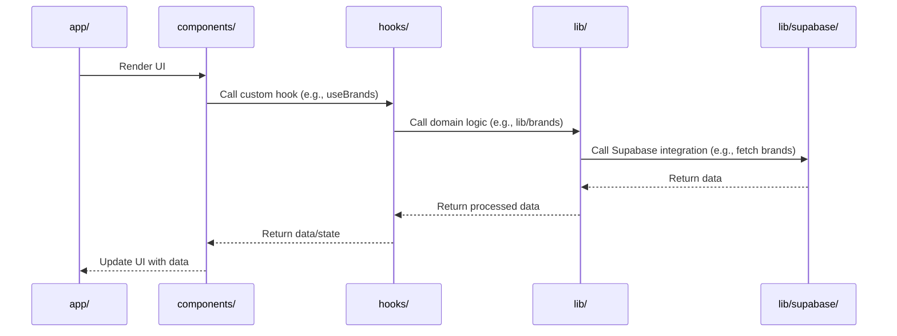

# Lead Delivery List AI — Copilot Agent Instructions

_Last updated: 2025-09-16_

## Project Overview

- **Stack:** Next.js (App Router), TypeScript (strict), Tailwind CSS, shadcn/ui, vitest, Supabase (PostgreSQL)
- **Purpose:** Track nationwide service coverage by zip code; route lead inquiries to the correct service provider
- **Auth & Data:** Supabase for authentication and data (see `lib/supabase/`)

## Architecture & Structure

```plaintext
ldl-ai/           # Root directory
├── app/          # Next.js App Router pages and layouts
├── components/   # UI and form components
├── lib/          # Domain logic, utilities, and cross-cutting concerns (e.g. Supabase integration)
├── supabase/     # Supabase CLI config and project files (note: database is PostgreSQL)
└── hooks/        # Custom React hooks serve as interface between `components/` and `lib/`
```

**Bringing it all together:** Pages in `app/` display `components/`. Components use hooks in `hooks/` for data fetching, state management, and business logic. Hooks call domain logic in `lib/` (e.g., `lib/zip/`), which in turn calls Supabase integration logic in `lib/supabase/`. **Never call Supabase directly in components or hooks.**

### Data Flow Sequence Diagram



## Developer Workflows

Before making changes: Check the `README.md` files in the directories and parent directories for area-focused guidelines.

- **Install dependencies:** `npm dev:setup` (automatically populates `.env.local`)
- **Run dev server:** `npm dev` (binds to 0.0.0.0 for WSL compatibility)
- **Lint:** `npm lint`
- **Write tests:** Co-locate tests alongside implementation files (e.g., `lib/feature/service.ts` → `lib/feature/service.test.ts`)
- **Run tests:** `npm test` (Vitest with watch mode)
- **Supabase status:** `npx supabase status` (shows local Supabase URLs)
- **Database migrations:** Use `supabase migration new <name>` and `supabase db reset` (see `supabase/`)
  - **Type Safety**: Generate types via `npm db:types` and update custom aliases in `database-types.ts`, avoiding duplication
  - **Update Types Throughout Application**: Check for outdated types throughout the application after database changes

## Project Conventions & Patterns

- **shadcn/ui:** Prefer for all new UI primitives (see `components/ui/`)
- **zod validation:** Use `zod` for all input validation (examples in `lib/**/validation.ts`)
- **Supabase integration:** All data/auth access via `lib/supabase/` (never call Supabase directly in components or hooks)
- **Tests:** Tests are co-located alongside implementation files (see `lib/zip/` for example)
- **Optimistic Concurrency:** All mutable entity update operations should assume optimistic concurrency control by default. Update operations MUST include the client's last-known `updated_at` (or equivalent version marker) and the server MUST reject stale updates with a 409-style conflict response pattern.

## Integration Points

- **Supabase:** All auth and data access via `lib/supabase/` with type aliases in `lib/supabase/database-types.ts`
- **UI:** shadcn/ui and Supabase UI components (see `components/`)
- **Deployment:** Not setup yet. This project is only developed locally at this time.
